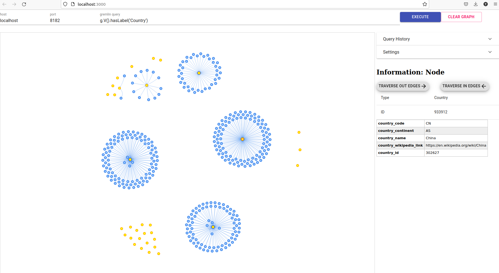

# POC 1 Flow

## First Run :-

### Pipeline
[CDAP Pipeline](Test1_v4-cdap-data-pipeline.json)


### Json Config for Plugin
```json
{
  "NODE_LIST": [
    {
      "label": "Airport",
      "id": "airport_id",
      "hardCodedLabel": true,
      "properties": [
        "ident",
        "type",
        "airport_name",
        "airport_wikipedia_link"
      ]
    },
    {
      "label": "Country",
      "id": "country_id",
      "hardCodedLabel": true,
      "properties": [
        "country_code",
        "country_name",
        "country_continent",
        "country_wikipedia_link"
      ]
    }
  ],
  "EDGE_LIST": [
    {
      "label": "belongsTo",
      "id": "airport_id",
      "hardCodedLabel": true,
      "fromLabel": "Airport",
      "toLabel": "Country",
      "properties": []
    }
  ]
}
```


### Results


