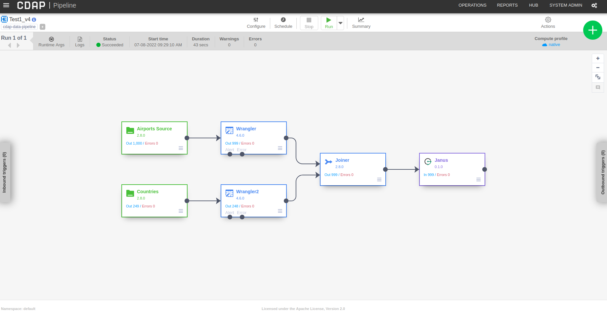
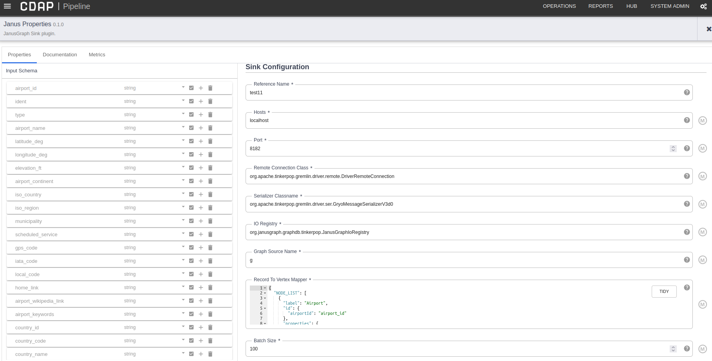
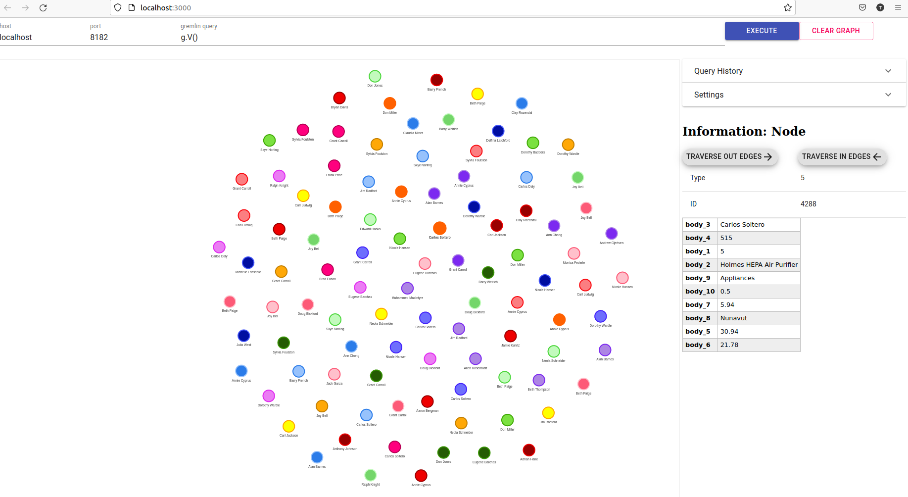
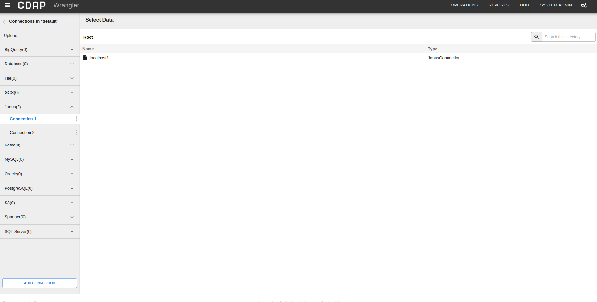
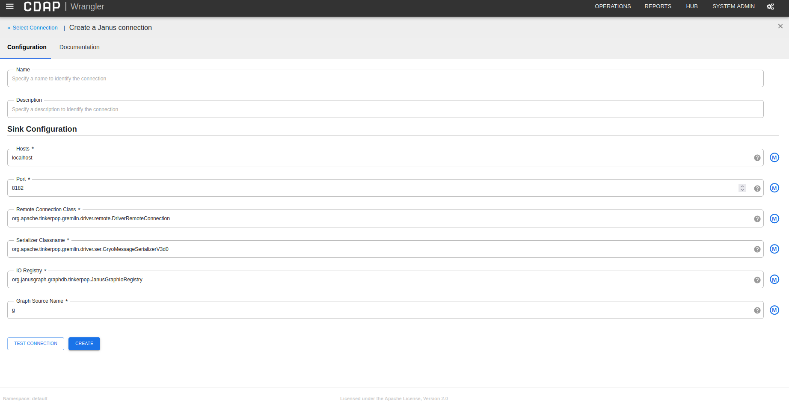

# Janus-Plugins for CDAP

## Features
- A generic plugin for data ingestion into JanusGraph.
- Configuration based Vertex and Edge creation.
- Connection Management for Janusgraph.

## Configuration for JanusSink Plugin
- Reference Name 
- Hosts
- Port
- Remote Connection Class
- Serializer Classname
- IO Registry
- Graph Source Name
- Record To Vertex Mapper
- Batch Size

## Record To Vertex Mapper :-
- Record to vertex Mapper is the Json based configuration which helps to know how the Structured Record needs to be processed.
- This configuration helps in creating vertices and edges from each StructuredRecord. This acts as metadata.
- Below is the format
```json
{
  "NODE_LIST": [
    {
      "label": "Field1",
      "id": {
        "PropertyKey": "ValueFromRecord"
      },
      "properties": {
        "PropertyKey1": "ValueFromRecord1",
        "PropertyKey2": "ValueFromRecord2"
      }
    }
  ],
  "EDGE_LIST": [
    {
      "label": "Field1",
      "fromLabel": "fromLabel",
      "toLabel": "toLabel",
      "properties": {
        "PropertyKey1": "ValueFromRecord1",
        "PropertyKey2": "ValueFromRecord2"
      }
    }
  ]
}
```
## Sample Run

### Pipeline
[CDAP Pipeline](Test1_v4-cdap-data-pipeline.json)



### JanusSink Configuration


### Results




## Connector Plugin

### Janus Connection Listing



### Populating Config for Janus Connection


